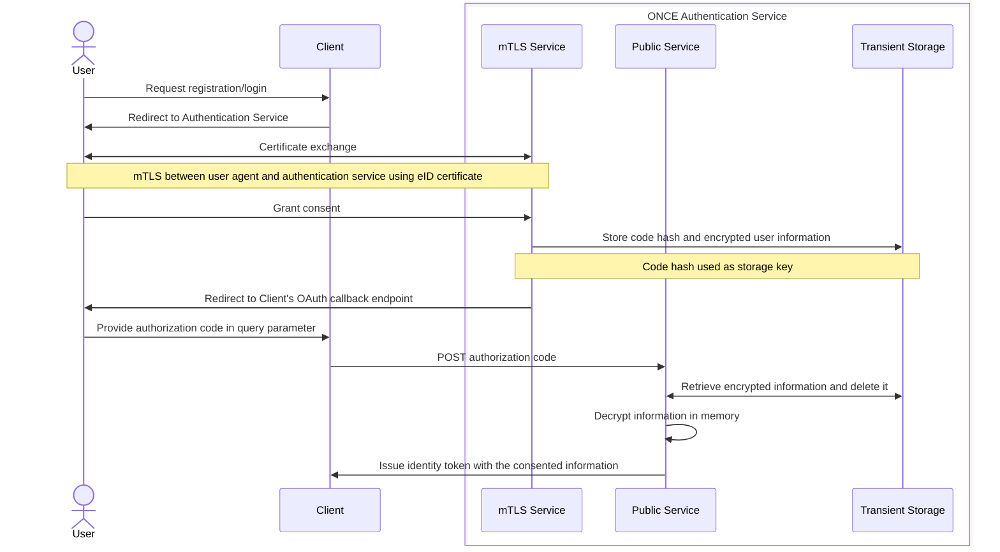

## Introduction

To me, some kind of Digital ID seems inevitable. However, it doesn't make it
desirable, and certainly not in the way it's often implemented today.

My main concern with many contemporary Digital ID schemes isn't with
authentication itself, but with the means by which it's accomplished. In
practice, this often translates to users being asked to upload pictures of
government issued documents to private companies whose business models revolves
around identity verification.

This trend is already visible in age verification requirements, such as
Australia's recent ban on social media access for people under 16 years old.[^1]
Whether such requirements will expand further, potentially requiring users to
associate their real world identity with online services beyond age verification
remains to be seen, but it would hardly be surprising.

Regardless of the sociopolitical motivations behind Digital ID, this article
concerns itself with the technical implementation. In particular, whether the
practice of collecting and storing copies of identity documents is truly
necessary. As to me, recent data breaches involving leaked images of government
IDs suggest otherwise.[^2]

When learning about these events, I ponder questions like: is there no better
way? Is it really necessary for users to hand over pictures of their ID to
companies which may be later acquired, compromised or repurposed? To me it seems
like proof of identity is being converted into a permanent corporate asset.[^3]

The answer is that better approaches already exist. There are ways to build
Digital ID systems that rely on cryptographic verification instead of data
extraction, which minimise disclosure by default, and which leave control over
identity attributes in the hands of the user rather than the service provider.

This article presents one such approach.

## An alternative

I live in Spain, where every citizen is legally required to possess a National
Identification Document (DNI). Like many national eID cards across the EU, the
Spanish DNIe includes a smart card chip (SLE78CLFX408AP) which stores
cryptographic material, including an authentication certificate.[^4]

This certificate allows citizens to access government services online with the
same legal validity and non-repudiation guarantees as a in-person
identification. Since this mechanism is deemed sufficiently trustworthy for
interactions with the state, it's reasonable to ask why it shouldn't also be
usable for other online services.

At a technical level, this authentication method relies on Public Key
Infrastructure (PKI). The citizen proves possession of a private key
corresponding to a certificate issued by a trusted Certificate Authority (CA).
This certificate is issued or renewed whenever the physical ID document is
renewed. So anyone with access to the CA's public certificates can verify the
authenticity of a certificate issued to a citizen.

Crucially, this approach avoids the need to transfer copies of identity
documents. Instead of extracting and storing personal data, the service instead
verifies a cryptographic statement: this user possesses a valid certificate
issued by a trusted authority.

An analogy to the real world would be showing an ID at a store when purchasing
alcohol. The clerk recognises the document as valid proof of age without making
a copy of it. However, it's important to be precise: the clerk still knows who
you are in that moment, and the store could record that information if it
chose to. What is avoided is the creation of a centralised identity database
detached from the original context of verification.

The same distinction applies here. PKI-based authentication _doesn't_ provide
anonymity or unlinkability by itself. Identity verification necessarily implies
some degree of linkability within a given context. What it does provide is a way
to constrain identity disclosure to what is actually required, without creating
permanent records or relying on third-party verification vendors.

In the system proposed in this article, identity attributes derived from the
certificate (such as name, date of birth, or identification number) are
disclosed strictly on a scope basis, with explicit user consent at authorisation
time. Many services don't require a user's real world identity at all; in those
cases, the service receives only the minimal attributes needed to function,
along with a non-identifying, opaque subject identifier.

Full legal identity disclosure remains possible where it's genuinely and
legitimately necessary. For example, in regulated or contractual contexts, but
it's no longer implicit. The user is informed of exactly what information will
be shared and can decide whether to proceed.

This approach aims to ensure that identity is disclosed deliberately,
proportionally, and transparently. Rather than by default.

Fortunately, the public certificates required to validate Spanish DNIe
authentication are published by the Cuerpo Nacional de Policía.[^5] This makes
it possible to build independent authentication services on top of existing
national infrastructure, without introducing new central identity brokers or
duplicating sensitive personal data.

## Threat model

Before delving into the details of the implementation, I think it's worth
pointing out what security and privacy concerns are specifically tackled by this
approach, the threats that have been taken into account and the inherent
limitations of the system.

### Actions and trust assumptions

The system involves the following actors:

- Resource owner (user): the individual authenticating user their national eID (DNIe).
- Authorisation service: the service described in this article, responsible for
  authentication, consent and token issuance.
- Client (relying party): an application requesting authentication and a
  selection of identity attributes.
- Certificate Authority: the issuing authority for national eID certificates.
- Network adversary: an attacker capable of observing or modifying network
  traffic.
- Server-side adversary: an attacker with partial or complete access to server
  infrastructure.

The system makes the following assumptions:

- The national CA correctly issues and revokes certificates.
- The user's eID private key isn't compromised.
- The client application behaves according to the OAuth2/OIDC protocol, but is
  otherwise untrusted.
- The authorisation service is honest-but-curious at most, and its source code
  is auditable.

No trust is placed on third-party identity verification vendors, biometric
pipelines, or document processing services.

---

### Threat: identity over-collection

A common failure mode of Digital ID systems is the indiscriminate collection of
identity data far beyond what is required for the service being accessed. This
is inherent to the submission of document pictures, where all data is readily
available.

#### Mitigation

Identity attributes are disclosed strictly on a scope basis. At authorisation
time, the user is presented with the exact set of attributes requested by the
client and must explicitly consent. Services that don't require a real world
identity can operate using non-identifying scopes, in which case the subject
identifier (`sub`) is a randomly generated opaque value.

#### Residual risk

Clients may still request excessive scopes. The system can't prevent this, but
it ensures the request is nevertheless explicit and visible to the user

---

### Threat: server compromise

An attacker gains access to the authorisation service's storage or runtime
environment.

#### Mitigation

At rest, stored identity data is encrypted using keys that aren't persistently
available to the server. Database records are indexed using hashes of
authorisation codes rather than direct identifiers. Compromise of stored data
aone doesn't yield usable identity information.

#### Residual risk

A fully compromised server during active sessions could access plaintext data in
memory. This threat is acknowledged and not fully mitigated, as doing so would
require trusted execution environments or HSM-backed workflows, which are
intentionally excluded from this proof-of-concept design.

---

### Threat: unauthorised token issuance

An attacker attempts to obtain tokens without valid possession of a national
eID.

#### Mitigation

Authentication relies on mutual TLS using the client certificate stored on the
eID. Private key material never leaves the card. Token issuance is bound to
successful certificate authentication and protocol correctness.

#### Residual risk

If the eID's private key is compromised at the user endpoint, impresonation is
possible. This is an inherent property of any certificate-based system and
outside the control of the authorisation service.

---

### Threat: replay and code interception

An attacker attempts to reuse authorisation codes or intercept token exchanges.

#### Mitigation

Authorisation codes are single-use, short-lived, and bound to the client. Codes
are hashed before storage and deleted immediately after use. Token exchange
occurs over authenticated TLS connections.

#### Residual risk

A compromised client could misuse received tokens. This is a standard OAuth2
risk and is addressed through token lifetimes and audience restrictions.

---

### Threat: cross-service linkability

A user's activity is correlated across multiple services.

#### Mitigation

The system doesn't introduce global identifiers beyond what is explicitly
disclosed. When non-identifying scopes are used, subject identifiers are opaque
and service-specific.

#### Non-goal

This system doesn't attempt to provide unlinkability across relying parties or
annoymous credentials. Linkability within a service context is inherent to
authentication and explicitly accepted.

---

### Threat: centralised identity observation

A central authority observes or aggregates user authentication events.

#### Mitigation

The CA is not involved in runtime authentication beyond certificate validation.
No external identity broker is consulted. The authorisation service doesn't
retain historical authentication records beyond operational logs.

OSCP is intentionally not used to avoid introducing real-time certificate status
queries to the issuing authority, which would create an additional observation
point for authentication events. This mirrors the broader industry trend away
from online revocation checks in favour of offline verification mechanisms like
CRLs.[^6]

#### Residual risk

Operational metadata may still be observable at the network and server level.

---

### Threat: misleading privacy guarantees

Users or relying parties misunderstand the privacy properties of the system.

#### Mitigation

The system makes no claims of anonymity. Consent screens explicitly describe
which attributes will be disclosed.

---

### Non-goals

This system intentionally doesn't aim to provide:

- Anonymous or unlinkable credentials
- Zero-knowledge proofs or attribute-based credentials
- Verifiable deletion guarantees
- Regulatory compliance as a qualified trust service
- Hardware-backed key isolation serverside

The purpose of this project is to demonstrate that most online services don't
require permanent possession of a user's identity, and that existing national
eID infrastructure can be leveraged to provide strong authentication without
replicating the widespread data-extractive practices.

## High level overview

The following diagram shows the authentication flow of the system using the
authorisation code flow per OAuth2 and it'll serve as a guide for the
following sections.

[^1]: Helen Livingstone, _Australia has banned social media for kids under 16. How will
    it work?_, BBC, 2025-12-10, <https://www.bbc.com/news/articles/cwyp9d3ddqyo>

[^2]: _Update on a Security Incident Involving Third-Party Customer Service_,
    Discord, 2025-10-03, <https://discord.com/press-releases/update-on-security-incident-involving-third-party-customer-service>

[^3]: Ingrid Lunden, _Entrust is buying AI-based ID verification startup Onfido,
    sources say for $650M_, TechCrunch, 2024-02-06, <https://techcrunch.com/2024/02/06/confirmed-entrust-is-buying-ai-based-id-verification-startup-onfido-sources-say-for-more-than-400m/>

[^4]: _Descripción del Chip DNIe 3.0_, Cuerpo Nacional de Policía, <https://www.dnielectronico.es/PortalDNIe/PRF1_Cons02.action?pag=REF_1078>

[^5]: Cuerpo Nacional de Policía, <http://pki.policia.es/dnie/certs/>

[^6]: Josh Aas, _Ending OCSP Support in 2025_, Let's Encrypt, 2024-12-05, <https://letsencrypt.org/2024/12/05/ending-ocsp>

