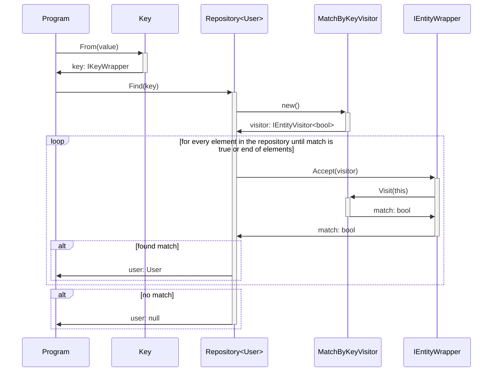

## Introduction

Designing a repository in C# I wanted something like this:

```csharp
interface IRepository<T> where T : BaseEntity
{
    T? Find(T.TKey id);
}
```

Here, the made-up syntax `T.TKey` means "use the ID type defined by the entity
itself". If `User` has `TKey = Guid`, then `Find` should accept a `Guid`. If
`Comment` has `TKey = int`, then `Find` should accept an `int`.

This has an instinctive feel to it. The repository already knows which entity it
works with, so it should also know the entity's key type. The problem? This
feature, called "existential types", doesn't exist in C# yet.

Rust, for example, brings this functionality through _associated types_ in
traits, requiring that each implementing struct fixes its own key type:

```rust
trait BaseEntity {
    type TKey;
    fn get_id(&self) -> &Self::TKey;
}
```

This guarantees at compile time that `Repository<User>::find` only accepts a
`u32` if that's the key type for `User`.

Since this functionality isn't natively available in C#, what can we do and how
close can we get to it?

This article explores one approach, inspired by the [existential
types][csharplang-8711] proposal and some functional programming tricks.
Step by step we're aiming for the following:

1. Define a flexible `BaseEntity` type.
2. Use the visitor pattern to abstract over different key types.
3. Wrap keys so repositories can safely compare them at runtime.

By the end, we'll have a working repository that enforces correct key usage. It
won't be as neat as Rust, but let's see how close we can get.

## Creating BaseEntity in C#

When designing our `BaseEntity`, we want to make it generic. We want each base
entity to have the possibility of saying `User` has a primary key of type `guid`
or `Comment` has a primary key type of `int`, so our `BaseEntity` might look
something like this at first:

```csharp
abstract class BaseEntity<TKey>
{
    public TKey? Id { get; set; }
}
```

However, if you recall from the beginning of the article, our `IRepository`
interface established a constraint that all the types a repository may be
instantiated with _must_ inherit from a non-generic `BaseEntity`.

When thinking about this, for me it felt vaguely intuitive that at this point
`BaseEntity<TKey>` must implement a non-generic interface so our repository can
make that its generic type constraint.

```csharp
abstract class BaseEntity<TKey> : ISomeInterface;

interface IRepository<T> where T : ISomeInterface;
```

Now we can define a `User` class, for example, that inherits from
`BaseEntity<Guid>` and which meets the criteria to be stored in our repository.
But we still don't know how to implement a `Find` method that respects each
entity's `TKey`.

Thanks to Brian Berns' lovely posts on functional programming in C#, I have a
rough idea of where to go next from here. Check out his articles
[here][brian-berns].

## What is ISomeInterface?

Since we said that all of our base entities implement a common interface which
enables us to treat them all equally regardless of the actual `TKey` or concrete
class that inherits from them, we might wonder: what's the point? What kind of
shared functionality do all base entities need to allow us to look them up
inside our repository's `Find` method?

`ISomeInterface` is a wrapper on all of our base entities that declares a method
which receives an object that will perform an operation on said base entity.
This allows us to create an object which contains a value and performs an
operation on any base entity checking if the value it contains matches the
entity's ID. This is what's called a visitor pattern which is defined as
follows:

> "Represent an operation to be performed on the elements of an object
> structure. Visitor lets you define a new operation without changing the
> classes of the elements on which it operates."[^1]

The visitor pattern requires that objects able to be visited implement an accept
method which receives an instance of a visitor object. So the interface for the
objects we want to visit might be defined like so:

```csharp
interface IEntityWrapper
{
    void Accept(IEntityVisitor visitor);
}
```

In the above example, you can see the second part to the visitor pattern. The
visitor interface, which must be implemented by all classes that can visit
objects. This is what our definition might look like:

```csharp
interface IEntityVisitor
{
    void Visit<TKey>(BaseEntity<TKey> entity);
}
```

Since our `BaseEntity<TKey>` implements `IEntityWrapper`, let's define the body
of `Accept` inside our base class:

```csharp
abstract class BaseEntity<TKey> : IEntityWrapper
{
    public TKey? Id { get; set; }

    public void Accept(IEntityVisitor visitor)
    {
        visitor.Visit(this);
    }
}
```

## Returning values from visitors

Our previous implementation of the visitor pattern, while aligned with the
definition, doesn't meet our needs yet, as we can't determine whether the
visited object is the one we're looking for because the return type of the
visitor's `Visit` method is `void`. The visitor needs to give the caller
information on whether the visited object is valid according to the internal
logic of the visitor's operation.

To solve this, let's define an interface for a visitor which returns a value
after visiting an entity:

```csharp
interface IEntityVisitor<TRet>
{
    TRet Visit<TKey>(BaseEntity<TKey> entity);
}
```

And our new visitor type also needs to be accepted by the entity wrapper
interface:

```csharp
interface IEntityWrapper
{
    // Previous methods...

    TRet Accept<TRet>(IEntityVisitor<TRet> visitor);
}

abstract class BaseEntity<TKey> : IEntityWrapper
{
    // Previous methods...
    
    public TRet Accept<TRet>(IEntityVisitor<TRet> visitor)
    {
        return visitor.Visit(this);
    }
}
```

With this, a class implementing `IEntityVisitor<TRet>` can visit any
`BaseEntity<TKey>`, regardless of its `TKey` type, perform operations on it, and
return a `TRet`. And in turn, visited entities which implement `IEntityWrapper`
will return the value produced by the visitor after accepting said visitor.

Now that we've got a visitor interface that can produce values, we need to
consider how to implement a visitor which contains a value that will be compared
with the visited entity's `Id` property and return whether it matches.

## A match by key visitor

As we previously mentioned, a visitor needs to be constructed with a fixed
value. For this we need to abstract away the type of the value the visitor
contains, similarly to how we abstract away the key type of our base entity.

In line with our `IEntityWrapper` interface, a solution for this is to wrap our
test key value in an interface, `IKeyWrapper`.

```csharp
interface IKeyWrapper
{
    bool TryUnwrap<TWanted>([NotNullWhen(true)] out TWanted? key);
}
```

This interface requires implementors to try to convert the underlying value to
the requested `TWanted` type, put it in the `out` parameter and return whether
the conversion succeeded. Its implementation might look like this:

```csharp
class KeyWrapper<TKey> : IKeyWrapper
{
    private readonly TKey _key;
    
    public KeyWrapper(TKey key)
    {
        _key = key;
    }

    public bool TryUnwrap<TWanted>([NotNullWhen(true)] out TWanted? key)
    {
        if (_key is TWanted k)
        {
            key = k;
            return true;
        }

        key = default;
        return false;
    }
}
```

Now we can create a visitor class that implements `IEntityVisitor<bool>` and
whose constructor receives an `IKeyWrapper` instance which it can use when
visiting entities.

```csharp
class MatchByKeyVisitor : IEntityVisitor<bool>
{
    private readonly IKeyWrapper _key;

    public MatchByKeyVisitor(IKeyWrapper key)
    {
        _key = key;
    }

    public bool Visit<TKey>(BaseEntity<TKey> entity)
    {
        return _key.TryUnwrap(out TKey? key) &&
               EqualityComparer<TKey>.Default.Equals(entity.Id, key);
    }
}
```

I think it's important to note how this technique works. Since our visit method
is generic over the entity's key type, `TKey`, we can ask the wrapped key to
try and unwrap to the same type. If it fails because our wrapped key and the
entity's key are of different types, we return false early. But if it succeeds
we can use the equality comparer for `TKey` with the `key` output and the
entity's ID.

With all of this, now we're ready to implement our `IRepository` interface we
mentioned in the beginning.

## Implementing `IRepository<T>`

For a minimal working example, let's implement our repository in-memory, and
let's add a few more methods you would see in a proper repository.

```csharp
class Repository<T> : IRepository<T> where T : IEntityWrapper
{
    private readonly List<T> _entities;
    
    public Repository()
    {
        _entities = [];
    }

    public void Add(T entity)
    {
        _entities.Add(entity);
    }

    public T? Find(IKeyWrapper key)
    {
        // Create our visitor from the user's provided search key
        MatchByKeyVisitor visitor = new(key);
        return _entities.SingleOrDefault(x => x.Accept(visitor));
    }
}
```

Lastly, let's create an `IKeyWrapper` factory to make instantiating a new
wrapper easy.

```csharp
static class Key
{
    public static IKeyWrapper From<TKey>(TKey key) => new KeyWrapper<TKey>(key);
}
```

Just like that we've got a fully working in-memory repository that treats all
entities equally, hiding the underlying key type for each entity. Let's see what
a minimum example looks like.

```csharp
class User : BaseEntity<int>
{
    public required string Name { get; set; }
}

Repository<User> userRepository = new();

userRepository.Add(new User { Id = 1, Name = "John" });
userRepository.Add(new User { Id = 2, Name = "Jane" });

IKeyWrapper key = Key.From(2);
User? user = userRepository.Find(key);

Console.WriteLine(user?.Name ?? "Not found"); // Prints "Jane"

key = Key.From("2");
user = userRepository.Find(key);

Console.WriteLine(user?.Name ?? "Not found"); // Prints "Not found"
```

## How it works as a whole

Let's look at the entrails and inspect what's happening when we call `Find`
with an `IKeyWrapper`.



Here you can see how the call stack drills all the way down to each individual
entity, who passes itself to the visitor so the latter can determine whether the
key it has in storage matches the key of the entity.

This is a pattern known in functional programming as continuation passing style,
CPS for short, and it can be defined as follows:

> If you have a value of type `T` that you don't want to expose directly, you
> can instead convert to CPS by implementing a function of type `(T -> TRet) ->
> TRet`, where `(T -> TRet)` is a continuation (i.e. a callback function).[^2]

We can see we apply the CPS pattern when we define the `Accept` method in our
`IEntityWrapper` interface. Although it isn't as explicit as defining `Accept`
as `TRet Accept<TRet>(Func<BaseEntity<T>, TRet> callback)`, that is indeed what
we're doing. We call `callback` (in our case `visitor.Visit`) with `this`,
producing a result of `TRet`, where `TRet` is defined by `IEntityVisitor<TRet>`,
that we accept.

## Goals review

We set out to replicate Rust's "associated types" in C#, applying them to a
practical example. Let's review how close we got to our goal.

- Did we manage to provide type-safe checks for entity keys?

Yes, sort of. It depends on whether we look at it from a glass half-full or
half-empty perspective. I haven't figured out a way we can provide compile-type
guarantees that the key we're looking up corresponds with the type of the key of
the entities contained in the repository.

However, we've provided a mostly safe runtime check which returns `false` if
the wrapped key's type and the entity's key type don't match. This could be
strengthened by throwing an exception if the types don't match.

- What are the drawbacks of this approach?

Aside from the aforementioned type safety, we need to keep in mind that runtime
checks are more expensive than compile-time checks. We're also creating an
instance of a visitor class every time we want to search for a matching key, and
checking for said matching key requires creating an instance of `KeyWrapper`.
This isn't overly costly, but it's not free performance-wise, unlike a
compile-time verification.

- Is the trade-off worth it?

I think so. Considering there isn't a way to implement the functionality we've
discussed in this article at the moment, achieving something close-ish to Rust's
"associated types" at what should be a relatively minimal runtime cost seems
like a worthwhile trade-off.

## Conclusion

In this article we've touched on CPS, functional programming in general, the
visitor pattern and the repository pattern. I'm not fully convinced this trick
is something that should go into production code, but at the very least it's
been very interesting learning beyond a surface level about all these topics.

I'm happy to have spent the time both learning about these concepts as well as
understanding them well enough to feel confident writing an article explaining
them.

Thank you for making it to the end, if you've made it this far you might be
interested in checking out the full source code of the project we've been
developing in the article at [MoreGenericRepository][more-generic-repository].

[csharplang-8711]: https://github.com/dotnet/csharplang/discussions/8711
[brian-berns]: https://dev.to/shimmer/functional-programming-in-c-3h6e
[more-generic-repository]: https://github.com/atan2l/MoreGenericRepository

[^1]: Erich Gamma et al., _Design Patterns: Elements of Reusable Object-Oriented
    Software_, Addison Wesley, 1994, p. 331

[^2]: Brian Berns, Existential types in C# - Part 3, 2020,
    <https://dev.to/shimmer/existential-types-in-c-part-3-5778>

