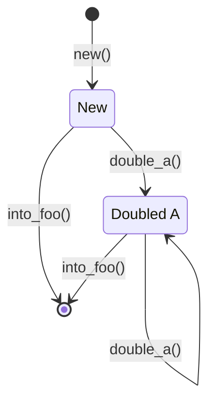
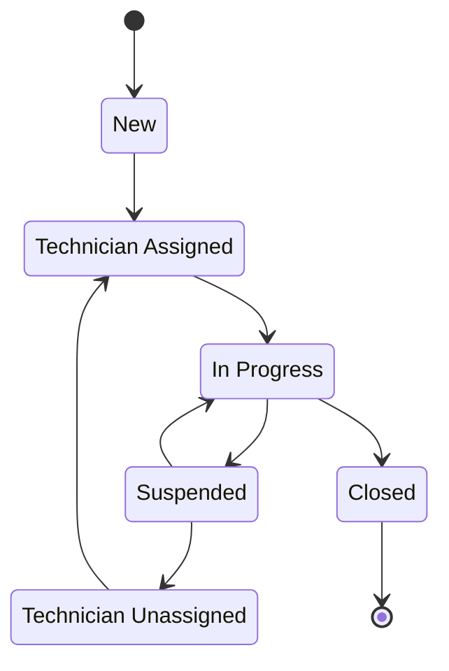

## Introduction

All programs are state machines. Sometimes we make this explicit by implementing
a finite state machine (FSM). While FSMs are common, I've rarely seen the
typestate pattern used in C#.

But what is this _typestate pattern_? When I talk about it, I'm referring to
typestate analysis, which can be _very briefly_ described like so:

> Typestates define valid sequences of operations that can be performed upon an
> instance of a given type. [...] This state information is used to determine at
> compile-time which operations are valid to be invoked upon an instance of the
> type.[^1]

This is a pattern I first learnt about by using Rust, more specifically, when
reading about embedded systems in Rust in [The Embedded Rust
Book](https://docs.rust-embedded.org/book/static-guarantees/typestate-programming.html).

In this article, we're going to briefly explore the typestate pattern in Rust
and, similarly to my previous article, implement it in C# with some
modifications.

At the end of this adventure, we'll have a way to robustly encode FSM behaviour
into our C# entities with reasonable compile-time verification.

## Typestate in Rust

To see how typestate works in Rust, we're going to go through the example code
provided in The Embedded Rust Book.

```rust
pub mod foo_module {
    #[derive(Debug)]
    pub struct Foo {
        inner: u32,
    }

    pub struct FooBuilder {
        a: u32,
        b: u32,
    }

    impl FooBuilder {
        pub fn new(starter: u32) -> Self {
            Self {
                a: starter,
                b: starter,
            }
        }

        pub fn double_a(self) -> Self {
            Self {
                a: self.a * 2,
                b: self.b,
            }
        }

        pub fn into_foo(self) -> Foo {
            Foo {
                inner: self.a + self.b,
            }
        }
    }
}

fn main() {
    let x = foo_module::FooBuilder::new(10)
        .double_a()
        .into_foo();

    println!("{:#?}", x);
}
```

In this snippet we can see there are two structs being defined: `Foo` and
`FooBuilder`. The latter also has an `impl` block that provides an associated
function `new` which constructs a new `FooBuilder` from an initial value and two
methods, `double_a` and `into_foo` which respectively double the internal value
of `a` and construct a `Foo` instance from the builder.

This is the FSM diagram of `FooBuilder`:


In plain text, this is the same as saying after you create a new `FooBuilder`
you can build your `Foo` or double `a` as many times as you want and then build
`Foo`.

I think this is a very clear description of what are valid operations on
`FooBuilder` and, perhaps more interestingly, they're enforced at compile time.

## An FSM problem

Now that we know the basic ideas behind typestate and before getting into the C#
implementation, let's describe a problem domain that we can solve by explicitly
programming an FSM.

Suppose we're creating a software for a company that services hardware
components. One of the things we've got to do is keep track of the repairs made
to each hardware unit sent. Let's call the entity that represents this
information a `ServiceRequest`.

We can intuitively tell that each service request is going to have different
valid states. Let's keep things relatively simple and define the following
states for our service request:

- New\
  The initial state for any service request when it's created.
- Technician assigned\
  The state that follows a new service request when a certain technician is
scheduled to service the hardware unit.
- Technician unassigned\
  A state indicating that the previously assigned technician has been
unassigned.
- In progress\
  The hardware unit is actively being worked on by the assigned technician.
- Suspended\
  Work on the hardware unit has been suspended. This can be for any number of
reasons, such as higher priority work, not enough materials to perform the
service, etc.
- Closed\
  The work on the hardware unit has been completed so the service request has
been closed.

With the aforementioned states, our FSM diagram might look something like this:



With the help of the FSM diagram, let's briefly touch on what might be the
underlying business logic that we want to implement by talking about the use
cases.

Based on our fictitious client's requirements, a service request must be in the
`New` state until a technician is assigned to it. When a technician is assigned
to a service request, they don't have to start work on it right away, it just
enters their backlog. Once the technician has started work, they may complete
their work and close the service request or they may suspend work on the service
request for a variety of reasons. If circumstances change after suspending the
service request, the work may be resumed by the assigned technician.
Alternatively, if the work is suspended, the technician may be unassigned from
the service request and it will be pending a technician assignment, similarly to
the `New` state, but with the information that some work has already been
performed.

Now, I'm aware that there are possibilities that aren't covered by the proposed
state transitions, such as reassigning a service request that hasn't had any
work done on it yet. That being said, I don't want to get lost in the details of
the functional requirements. So, while an inaccurate representation of the real
world, it's a more advanced example than what was shown in the earlier snippet
of Rust code, which is what I wanted.

## Typestate in C#

Now that we know what the state machine we want to implement looks like, we need
to consider how we're going to encode the states into C#'s type system.

My idea is to start with a generic interface, `ITypeState<T>`, from which all
specific state interfaces (such as `INewState`) will inherit. The generic type
parameter allows us to associate the derived interfaces to a specific class, so
if we use a `switch` expression or statement we won't have to concern ourselves
with matching on derived interfaces for entities other than the one specified in
`T`.

This is what our base interface might look like. Note that it has a reference to
the specific entity for which the state applies, which would be convenient if we
want to pass a reference of it to a function, and we also want to read or
modify the underlying object:

```csharp
public interface ITypeState<out T> where T : class
{
    public T Instance { get; }

    /// <summary>
    /// Checks whether the current TypeState instance matches the specified state
    /// of the instance.
    /// </summary>
    /// <returns></returns>
    bool CheckValidState();
}

```

We've also added a `CheckValidState` method. At first glance, this might seem
unnecessary: isn't the whole point of typestate to avoid runtime checks?

The key difference lies in Rust's ownership model. In the Rust example, methods
like `double_a` take `self` by value. That means the old instance is __moved__
and can't be used again. If `double_a` returned a different type (in the example
it returns `Self`), the compiler ensures that you can't call it twice on the
same value.

In C#, objects are always references, so the original instance is still around
even after a transition. Without additional checks, nothing prevents us from
accidentally reusing it. The `CheckValidState` method lets us fail fast at
runtime if a transition is attempted on a stale reference.

We've got a base from which to build up, so let's see some of the interfaces
which represent each of the states. I'm not including all of them here as to
avoid bloat but the full source code is available in the GitHub repository at
the end of the article.

### The state types

As we mentioned earlier, each state interface applies only to a single class
thanks to the generic type parameter of `ITypeState<T>`, so our inheriting
interfaces will specify a type for `T`.

```csharp
public interface INewState : ITypeState<ServiceRequest>
{
    /// <summary>
    /// Assigns a technician to the service request.
    /// </summary>
    /// <param name="technician"></param>
    IAssignedTechnicianState AssignTechnician(Technician technician);
}

public interface IAssignedTechnicianState : ITypeState<ServiceRequest>
{
    /// <summary>
    /// Starts work on the service request.
    /// </summary>
    /// <returns></returns>
    IInProgressState StartWork();
}

public interface IInProgressState : ITypeState<ServiceRequest>
{
    /// <summary>
    /// Closes the service request.
    /// </summary>
    /// <returns></returns>
    IClosedState Close();

    /// <summary>
    /// Suspends work on the service request.
    /// </summary>
    /// <returns></returns>
    ISuspendedState Suspend();
}

```

As we would expect, each state interface, respectively representing one state,
has the state transition methods which correspond with the transitions defined
in plain text and in our FSM diagram.

Now let's see what one of the classes that implements one of these interfaces
looks like. They're all quite similar, so I'm only showing the most complex of
the three above:

```csharp
internal class InProgressState : IInProgressState
{
    public ServiceRequest Instance { get; }

    public InProgressState(ServiceRequest serviceRequest)
    {
        Instance = serviceRequest;
        if (!CheckValidState())
        {
            throw new ArgumentException(
                "This state cannot be created for the given ServiceRequest instance.",
                nameof(serviceRequest)
            );
        }
    }

    public bool CheckValidState()
    {
        return Instance.CurrentState == ServiceRequestStates.InProgress;
    }

    public IClosedState Close()
    {
        if (!CheckValidState())
        {
            throw new InvalidOperationException();
        }

        Instance.StateTransition(ServiceRequestStates.Closed);
        return new ClosedState(Instance);
    }

    public ISuspendedState Suspend()
    {
        if (!CheckValidState())
        {
            throw new InvalidOperationException();
        }

        Instance.StateTransition(ServiceRequestStates.Suspended);
        return new SuspendedState(Instance);
    }
}
```

Here we can see some of the details that we haven't discussed yet. Most notably,
the use of a `ServiceRequestStates` enum, an internal `StateTransition` method
defined on `ServiceRequest` and the `CurrentState` property from
`ServiceRequest`, too. We'll go into more detail about them in the next section.

I'd like to highlight how this class has the `internal` modifier, to keep in
line with the dependency inversion principle and so that when we access the
state machine from the `ServiceRequest` entity, we try to convert the
`ITypeState<ServiceRequest>` interface into other interface types only.

## Modeling the problem domain

At this point, we should start considering what our domain entities are going to
look like. I'd like them to be somewhat realistic but without going into too
much detail.

Let's start with the main focus of our sample problem, `ServiceRequest`:

```csharp
public class ServiceRequest
{
    public ServiceRequest()
    {
        ServiceRequestEvents = [];
        StateTransition(ServiceRequestStates.New);
    }

    public Guid                      Id                   { get; set; }
    public List<ServiceRequestEvent> ServiceRequestEvents { get; }
    public Technician?               Technician           { get; internal set; }
    public ServiceRequestStates      CurrentState         { get; private set; }


    public ITypeState<ServiceRequest> StateMachine => CurrentState switch
    {
        ServiceRequestStates.New                  => new NewState(this),
        ServiceRequestStates.TechnicianAssigned   => new AssignedTechnicianState(this),
        ServiceRequestStates.TechnicianUnassigned => new UnassignedTechnicianState(this),
        ServiceRequestStates.InProgress           => new InProgressState(this),
        ServiceRequestStates.Suspended            => new SuspendedState(this),
        ServiceRequestStates.Closed               => new ClosedState(this),
        _                                         => throw new ArgumentOutOfRangeException()
    };

    internal void StateTransition(ServiceRequestStates state)
    {
        CurrentState = state;
        ServiceRequestEvents.Add(
            new ServiceRequestEvent
            {
                DateTime = DateTime.Now, RecordedState = state
            }
        );
    }
}
```

Here we've got some basic properties that map nicely to a database entry: `Id`
and `CurrentState`. The latter is an enum, which allows us to determine what
state type to return from the `StateMachine` auto property.

In this case, the enum is kept for persistence and database mapping, while the
typestate wrappers ensure safer transitions in business logic.

We also have `Technician`, which is a skeleton class more than anything else,
and `ServiceRequestEvents`, which Entity Framework can map to a one-to-many
relationship.

As for `ServiceRequestEvent`, it's a very simple, barebones class that only has
an `Id`, `DateTime` and `ServiceRequestStates` enum value to log when and what
state was set on the `ServiceRequest`.

Lastly, we've got the `internal StateTransition` method which is only used by
the state types to modify the `ServiceRequest`'s internal state and create the
corresponding event to log the modification.

## A working example

I feel like the steps to get here so far have been rather convoluted but,
fortunately using the entity we've created is almost as straightforward as it
would be in Rust.

Let's start by creating an entity, advancing its state to "In progress" and
inspecting the contents of the event list:

```csharp
Technician technician = new();
ServiceRequest serviceRequest = new();

switch (serviceRequest.StateMachine)
{
    case INewState ins:
        ins.AssignTechnician(technician).StartWork();
        break;
}

foreach (ServiceRequestEvent serviceRequestEvent in serviceRequest.ServiceRequestEvents)
{
    Console.WriteLine(serviceRequestEvent);
}
```

The above snippet produces the following output:

```text
Id: 00000000-0000-0000-0000-000000000000,
State: New,
Time: 2025-08-31 03:38:02

Id: 00000000-0000-0000-0000-000000000000,
State: TechnicianAssigned,
Time: 2025-08-31 03:38:02

Id: 00000000-0000-0000-0000-000000000000,
State: InProgress,
Time: 2025-08-31 03:38:02
```

Lastly, I'd like to showcase the utility of having a reference to the
`ServiceRequest` in the state object itself. Suppose we'd like to notify a
technician whenever a `ServiceRequest` is assigned to them.

Let's assume we have a notification service with the following interface:

```csharp
public interface INotificationService
{
    void SendAssignmentNotification(IAssignedTechnicianState state);
}
```

Notice how this service can only be invoked when the request is in the
`AssignedTechnician` state. And its implementation might look like so:

```csharp
internal class NotificationService : INotificationService
{
    public void SendAssignmentNotification(IAssignedTechnicianState state)
    {
        if (!state.CheckValidState())
        {
            throw new InvalidOperationException();
        }

        Debug.Assert(state.Instance.Technician is not null);
        string message = $"Hello {state.Instance.Technician.Name}, you've " +
            $"been assigned to service request {state.Instance.Id}.";

        // Actual message sending omitted...
    }
}
```

Here, the debug assertion enables us to compile our program without a possible
null dereference warning and we know for a fact that the instance referenced in
the state is valid.

This technique guarantees us that we only work with a service request in a
particular state and enriches the domain by, in this case, preventing a
notification of a service request that isn't in the correct state to be
notified.

## Conclusion

After exploring the typestate pattern in C#, I think it shows potential and
provides real benefits. However, when writing the code, I found it to be a
somewhat tedious and repetitive task due to the amount of boilerplate code
involved in implementing each state class.

The tediousness could probably be addressed by using an internal abstract base
class implementing `ITypeState<T>` which provides the constructor, instance
assignment and initial runtime state verification, leaving the rest of the class
only to implement `CheckValidState` and whatever state specific transition
methods are necessary. But keep in mind that this adds additional complexity to
the class hierarchy, although it's probably worthwhile and I'd recommend it for
serious implementations beyond my exploratory article.

In C#, typestate isn't as powerful as in Rust, since the lack of move semantics
means we must fall back on runtime checks. For strict correctness, though, the
pattern is still valuable. 

If all you need is a simple FSM, I recommend you continue using enums and
switches. But when you want the compiler to be an ally in keeping your business
rules straight, typestate can give you stronger guarantees. While enums
describe state, typestate enforces it.

I'd like to thank everyone that has made it to the end. If you're
interested in the complete source code of the project, please feel free to check
out the GitHub repository at
[TypestateArticle](https://github.com/atan2l/TypestateArticle).

Lastly, I'm happy with this foray into adapting typestate from Rust to C#.
I've thoroughly enjoyed thinking and rethinking the implementation until I got
to the point where I'm happy to talk about it and publish the development
process and my thoughts behind the pattern.

[^1]: Wikipedia, _Typestate analysis - Wikipedia_, 2025,
    <https://en.wikipedia.org/w/index.php?title=Typestate_analysis&oldid=1303687143>

