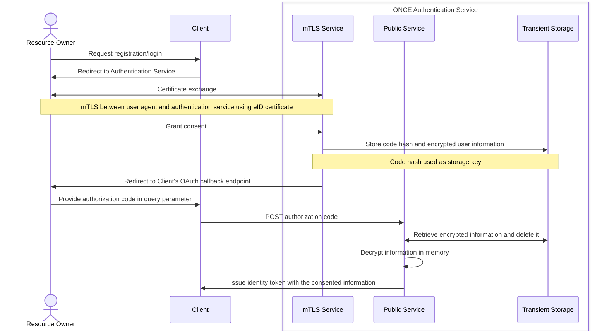

## Introduction

To me, some kind of Digital ID seems inevitable. However, it doesn't make it
desirable, and certainly not in the way it's often implemented today.

My main concern with many contemporary Digital ID schemes isn't with
authentication itself, but with the means by which it's accomplished. In
practice, this often translates to users being asked to upload pictures of
government issued documents to private companies whose business models revolves
around identity verification.

This trend is already visible in age verification requirements, such as
Australia's recent ban on social media access for people under 16 years old.[^1]
Whether such requirements will expand further, potentially requiring users to
associate their real world identity with online services beyond age verification
remains to be seen, but it would hardly be surprising.

Regardless of the sociopolitical motivations behind Digital ID, this article
concerns itself with the technical implementation. In particular, whether the
practice of collecting and storing copies of identity documents is truly
necessary. As to me, recent data breaches involving leaked images of government
IDs suggest otherwise.[^2]

When learning about these events, I ponder questions like: is there no better
way? Is it really necessary for users to hand over pictures of their ID to
companies which may be later acquired, compromised or repurposed? To me it seems
like proof of identity is being converted into a permanent corporate asset.[^3]

The answer is that better approaches already exist. There are ways to build
Digital ID systems that rely on cryptographic verification instead of data
extraction, which minimise disclosure by default, and which leave control over
identity attributes in the hands of the user rather than the service provider.

This article presents one such approach.

## An alternative

I live in Spain, where every citizen is legally required to possess a National
Identification Document (DNI). Like many national eID cards across the EU, the
Spanish DNIe includes a smart card chip (SLE78CLFX408AP) which stores
cryptographic material, including an authentication certificate.[^4]

This certificate allows citizens to access government services online with the
same legal validity and non-repudiation guarantees as a in-person
identification. Since this mechanism is deemed sufficiently trustworthy for
interactions with the state, it's reasonable to ask why it shouldn't also be
usable for other online services.

At a technical level, this authentication method relies on Public Key
Infrastructure (PKI). The citizen proves possession of a private key
corresponding to a certificate issued by a trusted Certificate Authority (CA).
This certificate is issued or renewed whenever the physical ID document is
renewed. So anyone with access to the CA's public certificates can verify the
authenticity of a certificate issued to a citizen.

Crucially, this approach avoids the need to transfer copies of identity
documents. Instead of extracting and storing personal data, the service instead
verifies a cryptographic statement: this user possesses a valid certificate
issued by a trusted authority.

An analogy to the real world would be showing an ID at a store when purchasing
alcohol. The clerk recognises the document as valid proof of age without making
a copy of it. However, it's important to be precise: the clerk still knows who
you are in that moment, and the store could record that information if it
chose to. What is avoided is the creation of a centralised identity database
detached from the original context of verification.

The same distinction applies here. PKI-based authentication _doesn't_ provide
anonymity or unlinkability by itself. Identity verification necessarily implies
some degree of linkability within a given context. What it does provide is a way
to constrain identity disclosure to what is actually required, without creating
permanent records or relying on third-party verification vendors.

In the system proposed in this article, identity attributes derived from the
certificate (such as name, date of birth, or identification number) are
disclosed strictly on a scope basis, with explicit user consent at authorisation
time. Many services don't require a user's real world identity at all; in those
cases, the service receives only the minimal attributes needed to function,
along with a non-identifying, opaque subject identifier.

Full legal identity disclosure remains possible where it's genuinely and
legitimately necessary. For example, in regulated or contractual contexts, but
it's no longer implicit. The user is informed of exactly what information will
be shared and can decide whether to proceed.

This approach aims to ensure that identity is disclosed deliberately,
proportionally, and transparently. Rather than by default.

Fortunately, the public certificates required to validate Spanish DNIe
authentication are published by the Cuerpo Nacional de Policía.[^5] This makes
it possible to build independent authentication services on top of existing
national infrastructure, without introducing new central identity brokers or
duplicating sensitive personal data.

## Threat model

Before delving into the details of the implementation, I think it's worth
pointing out what security and privacy concerns are specifically tackled by this
approach, the threats that have been taken into account and the inherent
limitations of the system.

### Actions and trust assumptions

The system involves the following actors:

- Resource owner (user): the individual authenticating with their national eID (DNIe).
- Authorisation service: the service described in this article, responsible for
  authentication, consent and token issuance.
- Client (relying party): an application requesting authentication and a
  selection of identity attributes.
- Certificate Authority: the issuing authority for national eID certificates.
- Network adversary: an attacker capable of observing or modifying network
  traffic.
- Server-side adversary: an attacker with partial or complete access to server
  infrastructure.

The system makes the following assumptions:

- The national CA correctly issues and revokes certificates.
- The user's eID private key isn't compromised.
- The client application behaves according to the OAuth2/OIDC protocol, but is
  otherwise untrusted.
- The authorisation service is honest-but-curious at most, and its source code
  is auditable.

No trust is placed on third-party identity verification vendors, biometric
pipelines, or document processing services.

---

### Threat: identity over-collection

A common failure mode of Digital ID systems is the indiscriminate collection of
identity data far beyond what is required for the service being accessed. This
is inherent to the submission of document pictures, where all data is readily
available.

#### Mitigation

Identity attributes are disclosed strictly on a scope basis. At authorisation
time, the user is presented with the exact set of attributes requested by the
client and must explicitly consent. Services that don't require a real world
identity can operate using non-identifying scopes, in which case the subject
identifier (`sub`) is a randomly generated opaque value.

#### Residual risk

Clients may still request excessive scopes. The system can't prevent this, but
it ensures the request is nevertheless explicit and visible to the user

---

### Threat: server compromise

An attacker gains access to the authorisation service's storage or runtime
environment.

#### Mitigation

At rest, stored identity data is encrypted using keys that aren't persistently
available to the server. Database records are indexed using hashes of
authorisation codes rather than direct identifiers. Compromise of stored data
aone doesn't yield usable identity information.

#### Residual risk

A fully compromised server during active sessions could access plaintext data in
memory. This threat is acknowledged and not fully mitigated, as doing so would
require trusted execution environments or HSM-backed workflows, which are
intentionally excluded from this proof-of-concept design.

---

### Threat: unauthorised token issuance

An attacker attempts to obtain tokens without valid possession of a national
eID.

#### Mitigation

Authentication relies on mutual TLS using the client certificate stored on the
eID. Private key material never leaves the card. Token issuance is bound to
successful certificate authentication and protocol correctness.

#### Residual risk

If the eID's private key is compromised at the user endpoint, impresonation is
possible. This is an inherent property of any certificate-based system and
outside the control of the authorisation service.

---

### Threat: replay and code interception

An attacker attempts to reuse authorisation codes or intercept token exchanges.

#### Mitigation

Authorisation codes are single-use, short-lived, and bound to the client. Codes
are hashed before storage and deleted immediately after use. Token exchange
occurs over authenticated TLS connections.

#### Residual risk

A compromised client could misuse received tokens. This is a standard OAuth2
risk and is addressed through token lifetimes and audience restrictions.

---

### Threat: cross-service linkability

A user's activity is correlated across multiple services.

#### Mitigation

The system doesn't introduce global identifiers beyond what is explicitly
disclosed. When non-identifying scopes are used, subject identifiers are opaque
and service-specific.

#### Non-goal

This system doesn't attempt to provide unlinkability across relying parties or
annoymous credentials. Linkability within a service context is inherent to
authentication and explicitly accepted.

---

### Threat: centralised identity observation

A central authority observes or aggregates user authentication events.

#### Mitigation

The CA is not involved in runtime authentication beyond certificate validation.
No external identity broker is consulted. The authorisation service doesn't
retain historical authentication records beyond operational logs.

OSCP is intentionally not used to avoid introducing real-time certificate status
queries to the issuing authority, which would create an additional observation
point for authentication events. This mirrors the broader industry trend away
from online revocation checks in favour of offline verification mechanisms like
CRLs.[^6]

#### Residual risk

Operational metadata may still be observable at the network and server level.

---

### Threat: misleading privacy guarantees

Users or relying parties misunderstand the privacy properties of the system.

#### Mitigation

The system makes no claims of anonymity. Consent screens explicitly describe
which attributes will be disclosed.

---

### Non-goals

This system intentionally doesn't aim to provide:

- Anonymous or unlinkable credentials
- Zero-knowledge proofs or attribute-based credentials
- Verifiable deletion guarantees
- Regulatory compliance as a qualified trust service
- Hardware-backed key isolation serverside

The purpose of this project is to demonstrate that most online services don't
require permanent possession of a user's identity, and that existing national
eID infrastructure can be leveraged to provide strong authentication without
replicating the widespread data-extractive practices.

## High-level overview

The following diagram shows the authentication flow of the system using the
authorisation code flow per OAuth2 and it'll serve as a guide for the
following sections.



The participants in this diagram mostly follow OAuth2 terminology, but there
isn't a resource server because there aren't protected resources that the client
may access and in fact, to satisfy the OIDC standards, an opaque access token is
issued which only contains random data since it can't be used anywhere.

The most relevant part of the diagram is the components of the ONCE
Authentication Service, as its functionality is separated across two services
due to the nature of mutual TLS. They make up the two sides of the coin that is
this implementation of OIDC which relies on client certificates to provide
identity information.

### mTLS Service

The mTLS Service, so-called because of its requirement for a client certificate
on all incoming connections is responsible for ensuring the provided certificate
has been issued by a trusted CA (DNIe CA) and retrieving the relevant
information stored in the user's certificate.

This service is only accessed by the resource owner as otherwise, clients would
also a trusted certificate. As such, only the OAuth `/authorize` endpoint is
implemented in this service.

The endpoint implementation critically handles generating the code which will
later be exchanged for the resource owner's information by the client. The code,
which is randomly generated from a cryptographically appropriate source
(`OsRng`), is used as the Initial Key Material from which an encryption key is
derived using HKDF.

The encryption key is used to encrypt the resource owner's information with
AES-256-GCM so that it can safely be stored in the transient storage until it's
retrieved as part of the code exchange, thus maintaining no plaintext personally
identifiable information.

To associate a resource owner's data with a request in the database, the primary
key includes the code's SHA256 hash, otherwise the encrypted data would be
stored with the encryption key, making it pointless.

### Public Service

The Public Service is responsible for exchanging the authorisation code provided
to a client by a resource owner for a token with the requested information about
the resource owner.

The resource owner's information, associated to the code, is present in the
transient storage and can be retrieved by reversing the process using during the
code creation and data storage.

Therefore, to retrieve the resource owner's information, the code is hashed and
all associated information based on its hash is retrieved and deleted from
storage. The retrieved information is decrypted using the code as the encryption
key and it's used to populate the OIDC ID token.

With this, access to the resource owner's data is ever only briefly in the hands
of the server or the server provider during its in-memory processing. Whenever
such sensitive information is handled elsewhere other than in-memory, it's
encrypted with a key not under the server's control that's handed over to the
resource owner themselves, giving them as much control over their data as
possible.

## Conclusion

At the time of writing this article, the service is little more than a proof of
concept. In fact, while I mention the use of scopes to restrict the degree of
access to an user's information, at the moment only the `openid` scope is
supported and retrieves all user information indiscriminately.

That being said, I stand by my belief that this is a genuinely more respectful
method to verify a person's identity. Ideally, consumers of such a service
wouldn't keep the information provided on file ad aeternum and it would suffice
to toggle a verification flag, but even if they did keep the information
forever, it's considerably so much better than keeping pictures of IDs.

Overall, I'm happy to leave this project rest as a proof of concept for the time
being. I'll probably return to tinkering with it again to fix some of its flaws
(we don't talk about the lack of `nonce` and `state` in the OAuth
implementation) as well as actually implementing access restrictions based on
scope. Alas, I think that will have to wait until I'm not so busy with work and
studying for university.

Nevertheless, I've thoroughly enjoyed learning more about TLS as a whole,
attempting to design a privacy-first system and using Rust for more complex
projects as I love the language but I feel like I'm not proficient enough with
it yet.

A particularly honourable mention to [Aurelia Molzer](https://github.com/197g)
and everyone involved in the development of
[`oxide-auth`](https://github.com/197g/oxide-auth) for creating such a flexible
crate to implement OAuth2 servers. I feel like my understanding of OAuth2 and
its different stages has deepened considerably after implementing my own OAuth2
endpoint with this crate.

## A little demo

To show what a consumer of this service would look like I wrote a small demo
application with C#/.NET, using the
`Microsoft.AspNetCore.Authentication.OpenIdConnect` package to demonstrate that
the implementation is at least mostly standards compliant and a generic OIDC
package can be configured to consume the service out of the box.

Here's the very simple builder config that reads the settings and points to the
ONCE service:

```csharp
builder.Services.AddAuthentication(
           options =>
           {
               options.DefaultScheme          = CookieAuthenticationDefaults.AuthenticationScheme;
               options.DefaultChallengeScheme = OpenIdConnectDefaults.AuthenticationScheme;
           }
       )
       .AddCookie()
       .AddOpenIdConnect(
           options =>
           {
               IConfigurationSection oidcConfig = builder.Configuration.GetSection("Oidc");
               options.Authority = oidcConfig["Authority"] ??
                                   throw new InvalidOperationException("OIDC Authority is missing.");
               options.ClientId = oidcConfig["ClientId"] ??
                                  throw new InvalidOperationException("OIDC ClientId is missing.");
               options.ResponseType = oidcConfig["ResponseType"] ?? "code";
               options.SaveTokens   = true;

               options.ProtocolValidator =
                   new OpenIdConnectProtocolValidator { RequireNonce = false, RequireState = false };

               options.BackchannelHttpHandler = new HttpClientHandler
               {
                   ServerCertificateCustomValidationCallback =
                       HttpClientHandler.DangerousAcceptAnyServerCertificateValidator
               };

               // Scope "openid" is added by default, but we can be explicit
               options.Scope.Clear();
               options.Scope.Add("openid");

               options.TokenValidationParameters = new TokenValidationParameters
               {
                   NameClaimType = ClaimTypes.GivenName, ValidateIssuer = true,
               };

               options.Events = new OpenIdConnectEvents
               {
                   OnRedirectToIdentityProvider = context =>
                                                  {
                                                      /*
                                                       * If it's a registration request, we might want to pass a
                                                       * parameter. Usually this is handled by the provider if prompted
                                                       * or via a specific ACR/prompt
                                                       */
                                                      if (context.Properties.Items.TryGetValue(
                                                              "prompt",
                                                              out string? prompt
                                                          ))
                                                      {
                                                          context.ProtocolMessage.Prompt = prompt;
                                                      }

                                                      return Task.CompletedTask;
                                                  }
               };
           }
       );
```

And this is what it looks like:


Clicking either "Login" or "Register" redirects us to the OIDC provider, where
the browser requests a certificate:


After sending the certificate, we're taken to the consent page where we're shown
what information will be shared with the client:


Upon allowing access to our information, we're taken back to the client where we
can see the information that has been shared with the client in our profile
page:


[^1]: Helen Livingstone, _Australia has banned social media for kids under 16. How will
    it work?_, BBC, 2025-12-10, <https://www.bbc.com/news/articles/cwyp9d3ddqyo>

[^2]: _Update on a Security Incident Involving Third-Party Customer Service_,
    Discord, 2025-10-03, <https://discord.com/press-releases/update-on-security-incident-involving-third-party-customer-service>

[^3]: Ingrid Lunden, _Entrust is buying AI-based ID verification startup Onfido,
    sources say for $650M_, TechCrunch, 2024-02-06, <https://techcrunch.com/2024/02/06/confirmed-entrust-is-buying-ai-based-id-verification-startup-onfido-sources-say-for-more-than-400m/>

[^4]: _Descripción del Chip DNIe 3.0_, Cuerpo Nacional de Policía, <https://www.dnielectronico.es/PortalDNIe/PRF1_Cons02.action?pag=REF_1078>

[^5]: Cuerpo Nacional de Policía, <http://pki.policia.es/dnie/certs/>

[^6]: Josh Aas, _Ending OCSP Support in 2025_, Let's Encrypt, 2024-12-05, <https://letsencrypt.org/2024/12/05/ending-ocsp>

